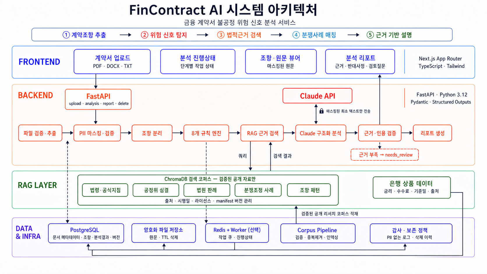

# FinContract AI

금융 계약서에서 불공정 가능성이 있는 위험 신호를 찾고, 검증 가능한 법적 근거와 분쟁사례를 함께 제시하는 의사결정 지원 서비스입니다.

이 프로젝트는 법률 자문, 위법성 확정 또는 재판 결과 예측을 제공하지 않습니다. 결과는 위험 신호와 검토 필요성을 설명하는 보조 자료이며 최종 판단에는 전문가 검토가 필요합니다.

동시에 이 저장소는 **현대자동차그룹 버티컬 AI 프레임을 참고해, 도메인 지식·도구·데이터·사람의 검토를 결합한 Agent AI가 실제 업무 품질과 효율을 개선하는지 검증하는 PoC**입니다. 공식 현대자동차그룹 서비스나 승인된 사내 프로젝트를 의미하지 않으며, 공개·허가·합성 데이터로 실험한 뒤 적용 가능성과 한계를 학습하는 것을 목표로 합니다.



## 현재 상태

- 프로젝트 스캐폴딩 프롬프트 v2 작성 완료
- 시스템 아키텍처 이미지 v3 작성 완료
- 모노레포 디렉터리와 데이터 거버넌스 시작 문서 준비 완료
- 독립 Git 저장소와 worktree 기반 협업 규칙 준비 완료
- 실제 애플리케이션 코드는 아직 구현하지 않음
- 실험 001용 여신약관 3개 규칙 기준선과 합성 스모크 평가 구현
- 리서치 통계 641건·16건은 근거 manifest 검증 전까지 후보 수로만 관리

상세 상태와 다음 작업은 [PROJECT_STATUS.md](PROJECT_STATUS.md)를 참고하세요.

레이어별 실제 구현과 검증 여부는 [시스템 아키텍처 구현·검증 매트릭스](docs/implementation-matrix.md)에서 추적합니다. `implemented`와 `verified`를 구분하며, 실행하지 못한 Docker나 실제 데이터·Claude 연결은 완료로 표시하지 않습니다.

현재 진행 중인 첫 비교 기준은 [실험 001: 여신약관 규칙 엔진](experiments/001-rule-baseline/README.md)입니다.

## 우리가 실험하려는 것

핵심 질문은 “에이전트를 많이 사용하면 좋은가?”가 아니라 다음과 같습니다.

> 금융 계약 검토 업무를 도메인별 단계로 분해하고, 결정론적 안전 도구와 전문 에이전트를 조합했을 때 단일 LLM 또는 규칙 엔진보다 더 정확하고 추적 가능하며 효율적인 결과를 만들 수 있는가?

이를 다음 가설로 검증합니다.

1. **도메인 지식 가설**: 법령·표준약관·불공정약관·분쟁사례를 검색해 근거를 강제하면 근거 없는 법적 참조가 감소한다.
2. **역할 분리 가설**: 검색·분석·검증을 분리하면 단일 LLM보다 인용 정확도와 위험 탐지 품질이 향상된다.
3. **안전 게이트 가설**: PDF 처리, PII 마스킹, 규칙 실행, 인용 검증을 코드 기반 게이트로 두면 자율 에이전트만 사용할 때보다 개인정보와 법률 리스크가 감소한다.
4. **Human-in-the-loop 가설**: 사람의 승인·수정 데이터를 수집하면 검토 시간을 줄이면서도 최종 판단 책임과 설명 가능성을 유지할 수 있다.
5. **최소 복잡도 가설**: 멀티 에이전트의 품질 향상이 비용·지연·운영 복잡도를 상쇄할 때만 해당 구조를 채택해야 한다.

### 비교 실험군

모든 실험군은 동일한 평가셋과 출력 스키마를 사용합니다.

| 실험군 | 구성 | 확인할 내용 |
|---|---|---|
| A | 8개 규칙 엔진 | 최소 비용 기준선과 규칙별 탐지 성능 |
| B | 단일 LLM, RAG 없음 | 일반 모델의 기본 추론 성능과 환각 위험 |
| C | RAG + 단일 분석 에이전트 | 도메인 근거가 품질에 미치는 영향 |
| D | 계획 + 검색 + 분석 + 검증 | 역할 분리의 추가 효과와 운영 비용 |

B는 연구용 비교군이며, 마스킹되지 않은 원문을 외부 모델로 전송하지 않습니다. 검색 코퍼스와 평가셋은 분리해 데이터 누수를 방지합니다.

### 성공 판단

아래 네 영역을 함께 측정하며 정확도 하나만으로 채택 여부를 결정하지 않습니다.

- 품질: 규칙별 precision·recall·F1, 근거 인용 일치율, 검토자 동의율
- 안전: PII 외부 유출 0건, 근거 없는 법적 참조 수, 안전한 `needs_review` 전환율
- 업무 효과: 문서당 검토시간, 근거 탐색시간, 검토자 수정·기각률
- 운영성: 문서당 비용, 처리시간, 실패·재시도율, 버전별 재현성

멀티 에이전트 D가 C보다 의미 있는 품질 또는 업무 효과 개선을 보이지 않으면 더 단순한 C를 기본 구조로 채택합니다.

## 버티컬 AI 실험 구조

```text
UI/UX                 업로드 · 원문/근거 대조 · 사람의 승인/수정
Management            워크플로 상태 · 재시도 · 감사로그 · 버전 관리
AI Service            계획 · 근거 검색 · 계약 분석 · 결과 검증
Deterministic Tools   파일 검증 · PII 마스킹 · 조항 분리 · 8개 규칙 · 인용 검사
Data                   PostgreSQL · ChromaDB 5개 컬렉션 · 평가셋 · 출처 manifest
Infrastructure         Docker Compose · CI · 비밀정보 관리 · 관측성
```

자율 판단이 필요한 계획·검색·분석·검증만 에이전트 후보로 둡니다. PDF 파싱, PII 마스킹, 규칙 실행, 리포트 렌더링은 재현 가능한 서비스로 유지합니다.

## 개발하면서 실험하는 방법

기능을 모두 만든 뒤 한 번에 평가하지 않고, 다음 순서로 작동하는 기준선을 누적합니다.

1. 한 종류의 금융 계약과 2~3개 탐지 규칙으로 좁힌 골드셋을 만든다.
2. 규칙 엔진 기준선 A를 실행하고 실패 사례를 고정한다.
3. 동일 입력·출력 계약으로 B와 C를 추가해 RAG 효과를 비교한다.
4. C에서 반복되는 오류가 확인될 때만 계획 또는 검증 에이전트를 추가한다.
5. 두 명 이상의 검토자가 블라인드 평가하고 불일치 사유를 기록한다.
6. 채택한 구성을 소규모 파일럿에 적용하고 시간·비용·수정률을 측정한다.
7. 규칙, prompt, 모델, corpus, 평가셋 버전을 고정해 같은 결과를 재현한다.

각 PR은 가능하면 하나의 가설 또는 측정 지표와 연결합니다. 실험 결과는 성공 사례뿐 아니라 실패·기각된 접근도 [실험 운영 가이드](docs/experiments.md)에 따라 남깁니다.

## 핵심 처리 순서

```text
파일 검증·로컬 추출
  → PII 마스킹·검증
  → 조항 분리
  → 8개 규칙 엔진
  → ChromaDB 근거 검색
  → Claude 구조화 분석
  → 근거·인용 검증
  → 결과 저장 및 리포트
```

마스킹되지 않은 사용자 원문은 ChromaDB 또는 Claude API로 전달하지 않습니다. ChromaDB에는 검증된 공개·허가 리서치 코퍼스만 적재합니다.

## 기술 방향

- Frontend: Next.js App Router, TypeScript, Tailwind CSS
- Backend: Python 3.12, FastAPI, Pydantic v2, SQLAlchemy 2
- Operational data: PostgreSQL
- Retrieval: ChromaDB
- LLM: Anthropic Claude Messages API + Structured Outputs
- Optional async processing: Redis + Worker
- Local runtime: Docker Compose

## 로컬 전체 실행

Docker가 없는 환경에서도 Backend와 Frontend를 각각 검증할 수 있습니다.

```bash
make setup-backend
make setup-frontend
make test-backend
make ingest-demo
make verify-index
make test-frontend
```

개발 서버는 두 터미널에서 실행합니다.

```bash
make run-backend
make run-frontend
```

그 다음 `http://localhost:3000`에서 TXT, PDF 또는 DOCX를 업로드합니다. 현재 실제 법률 코퍼스와 Claude는 연결하지 않았으므로 화면의 근거와 분석은 합성·mock 상태를 명확히 표시합니다.

Docker 런타임이 준비된 경우 다음 명령으로 PostgreSQL, Redis, ChromaDB, Backend와 Frontend를 함께 기동합니다.

```bash
docker compose up --build
```

## 주요 문서

- [스캐폴딩 프롬프트 v2](prompts/project_scaffolding_prompt_v2.md)
- [아키텍처 설명](docs/architecture.md)
- [법률 판단 경계](docs/legal-boundary.md)
- [데이터 거버넌스](docs/data-governance.md)
- [평가 기준](docs/evaluation.md)
- [실험 운영 가이드](docs/experiments.md)
- [에이전트 모델·토큰 라우팅](docs/model-routing.md)
- [실행 가능한 오프라인 프로토타입](docs/prototype.md)
- [기여 가이드](CONTRIBUTING.md)
- [Git 협업 및 worktree 운영](docs/git-workflow.md)
- [리서치 자료 준비 안내](research/README.md)

## 협업 원칙

- `main`은 동기화와 배포 기준으로만 사용합니다.
- 기능 구현은 작업별 브랜치와 별도 worktree에서 수행합니다.
- Pull Request는 최소 1명 승인과 CI 통과 후 squash merge합니다.
- 새 worktree는 `scripts/new-worktree.sh`로 생성합니다.

## 첫 번째 실험 시작 게이트

다음 항목을 확정한 뒤 1단계 구현을 시작합니다.

1. 리서치 원본 파일과 출처 목록 확보
2. 641건·16건의 집계 기준 및 중복 제거 기준 확인
3. 공개 자료별 라이선스·재배포 가능 여부 확인
4. Python 3.12와 Node 런타임 버전 고정
5. 첫 번째 대상 계약 유형과 2~3개 탐지 규칙 선택
6. 검색 코퍼스와 겹치지 않는 소규모 골드셋 및 검토자 확보
7. MVP에서 Redis Worker를 사용할지 결정
