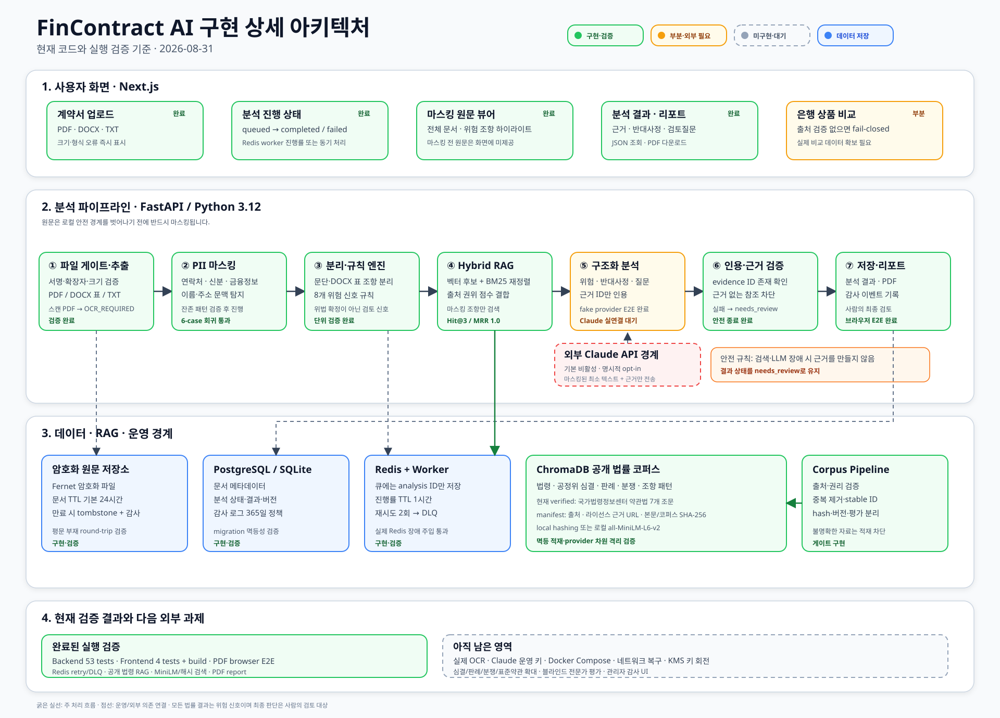

# FinContract AI

금융 계약서에서 불공정 가능성이 있는 위험 신호를 찾고, 검증 가능한 법적 근거와 분쟁사례를 함께 제시하는 의사결정 지원 서비스입니다.

이 프로젝트는 법률 자문, 위법성 확정 또는 재판 결과 예측을 제공하지 않습니다. 결과는 위험 신호와 검토 필요성을 설명하는 보조 자료이며 최종 판단에는 전문가 검토가 필요합니다.

동시에 이 저장소는 **현대자동차그룹 버티컬 AI 프레임을 참고해, 도메인 지식·도구·데이터·사람의 검토를 결합한 Agent AI가 실제 업무 품질과 효율을 개선하는지 검증하는 PoC**입니다. 공식 현대자동차그룹 서비스나 승인된 사내 프로젝트를 의미하지 않으며, 공개·허가·합성 데이터로 실험한 뒤 적용 가능성과 한계를 학습하는 것을 목표로 합니다.



## 현재 상태

- Next.js 업로드·분석 대시보드와 FastAPI 문서/분석/PDF 리포트 API 구현
- PDF/DOCX/TXT 추출, PII 마스킹, 19개 규칙, 오프라인 다국어 E5 의미 후보, RAG 근거 검증 구현
- PostgreSQL 메타데이터, Redis worker 재시도·격리, ChromaDB 5개 컬렉션 구현
- Fernet 원문 암호화, 문서 TTL, 감사 로그·만료와 관리자 보호 조회 구현
- 결정론적 문서·항목 요약과 개인정보가 픽셀 단위로 제거된 PDF 원문 조각 구현
- 공개 API와 화면에서 문서 전문을 제거하고 조각 소유권 검증·24시간 만료 삭제 구현
- 국가법령정보센터 약관법 7개 조문과 출처·hash manifest, 로컬 검색 평가 구현
- 백엔드 테스트와 프론트엔드 단위 테스트·프로덕션 빌드 검증
- 리서치 통계 641건·16건은 근거 manifest 검증 전까지 후보 수로만 관리

상세 상태와 다음 작업은 [PROJECT_STATUS.md](PROJECT_STATUS.md)를 참고하세요.

레이어별 실제 구현과 검증 여부는 [시스템 아키텍처 구현·검증 매트릭스](docs/implementation-matrix.md)에서 추적합니다. `implemented`와 `verified`를 구분하며, 실행하지 못한 Docker나 실제 데이터·Claude 연결은 완료로 표시하지 않습니다.

현재 진행 중인 첫 비교 기준은 [실험 001: 여신약관 규칙 엔진](experiments/001-rule-baseline/README.md)입니다.

## 우리가 실험하려는 것

핵심 질문은 “에이전트를 많이 사용하면 좋은가?”가 아니라 다음과 같습니다.

> 금융 계약 검토 업무를 도메인별 단계로 분해하고, 결정론적 안전 도구와 전문 에이전트를 조합했을 때 단일 LLM 또는 규칙 엔진보다 더 정확하고 추적 가능하며 효율적인 결과를 만들 수 있는가?

이를 다음 가설로 검증합니다.

1. **도메인 지식 가설**: 법령·표준약관·불공정약관·분쟁사례를 검색해 근거를 강제하면 근거 없는 법적 참조가 감소한다.
2. **역할 분리 가설**: 검색·분석·검증을 분리하면 단일 LLM보다 인용 정확도와 위험 탐지 품질이 향상된다.
3. **안전 게이트 가설**: PDF 처리, PII 마스킹, 규칙 실행, 인용 검증을 코드 기반 게이트로 두면 자율 에이전트만 사용할 때보다 개인정보와 법률 리스크가 감소한다.
4. **Human-in-the-loop 가설**: 사람의 승인·수정 데이터를 수집하면 검토 시간을 줄이면서도 최종 판단 책임과 설명 가능성을 유지할 수 있다.
5. **최소 복잡도 가설**: 멀티 에이전트의 품질 향상이 비용·지연·운영 복잡도를 상쇄할 때만 해당 구조를 채택해야 한다.

### 운영 분석과 내부 기준선

운영 API·화면·PDF는 A/D 선택 없이 단일 `full_pipeline`만 제공합니다. 이 파이프라인은 19개 결정론 규칙의 `findings[]`와 오프라인 E5의 `candidate_findings[]`를 분리해 반환합니다. 내부 평가 CLI의 `rules-only` 기준선은 회귀 측정에만 사용하며 운영 기능이 아닙니다. full은 rules-only의 결정론 결과를 삭제하거나 변경할 수 없습니다.

### 성공 판단

아래 네 영역을 함께 측정하며 정확도 하나만으로 채택 여부를 결정하지 않습니다.

- 품질: 규칙별 precision·recall·F1, 근거 인용 일치율, 검토자 동의율
- 안전: PII 외부 유출 0건, 근거 없는 법적 참조 수, 안전한 `needs_review` 전환율
- 업무 효과: 문서당 검토시간, 근거 탐색시간, 검토자 수정·기각률
- 운영성: 문서당 비용, 처리시간, 실패·재시도율, 버전별 재현성

멀티 에이전트 D가 C보다 의미 있는 품질 또는 업무 효과 개선을 보이지 않으면 더 단순한 C를 기본 구조로 채택합니다.

## 버티컬 AI 실험 구조

```text
UI/UX                 업로드 · 원문/근거 대조 · 사람의 승인/수정
Management            워크플로 상태 · 재시도 · 감사로그 · 버전 관리
AI Service            계획 · 근거 검색 · 계약 분석 · 결과 검증
Deterministic Tools   파일 검증 · PII 마스킹 · 조항 분리 · 19개 규칙 · 인용 검사
Data                   PostgreSQL · ChromaDB 5개 컬렉션 · 평가셋 · 출처 manifest
Infrastructure         Docker Compose · CI · 비밀정보 관리 · 관측성
```

자율 판단이 필요한 계획·검색·분석·검증만 에이전트 후보로 둡니다. PDF 파싱, PII 마스킹, 규칙 실행, 리포트 렌더링은 재현 가능한 서비스로 유지합니다.

## 개발하면서 실험하는 방법

기능을 모두 만든 뒤 한 번에 평가하지 않고, 다음 순서로 작동하는 기준선을 누적합니다.

1. 한 종류의 금융 계약과 2~3개 탐지 규칙으로 좁힌 골드셋을 만든다.
2. 내부 `rules-only` 기준선을 실행하고 실패 사례를 고정한다.
3. 동일 입력·출력 계약으로 B와 C를 추가해 RAG 효과를 비교한다.
4. C에서 반복되는 오류가 확인될 때만 계획 또는 검증 에이전트를 추가한다.
5. 두 명 이상의 검토자가 블라인드 평가하고 불일치 사유를 기록한다.
6. 채택한 구성을 소규모 파일럿에 적용하고 시간·비용·수정률을 측정한다.
7. 규칙, prompt, 모델, corpus, 평가셋 버전을 고정해 같은 결과를 재현한다.

각 PR은 가능하면 하나의 가설 또는 측정 지표와 연결합니다. 실험 결과는 성공 사례뿐 아니라 실패·기각된 접근도 [실험 운영 가이드](docs/experiments.md)에 따라 남깁니다.

## 핵심 처리 순서

```text
파일 검증·로컬 추출
  → PII 마스킹·검증
  → 조항 분리
  → 19개 규칙 엔진
  → 오프라인 다국어 E5 의미 검토 후보
  → ChromaDB 근거 검색
  → 결정론적 요약·근거 검증
  → 마스킹 PDF 원문 조각 생성
  → 결과 저장 및 리포트
```

사용자 원문은 외부 모델 API로 전달하지 않습니다. ChromaDB에는 검증된 공개·허가 리서치 코퍼스만 적재하고, 공개 API와 브라우저에는 탐지된 조항의 마스킹 조각만 제공합니다.

## 기술 방향

- Frontend: Next.js App Router, TypeScript, responsive CSS
- Backend: Python 3.12, FastAPI, Pydantic v2, SQLAlchemy 2
- Operational data: PostgreSQL
- Retrieval: ChromaDB
- Summary: 외부 생성형 모델 없이 사실 추출 + 19개 규칙 템플릿
- Local semantic review: `intfloat/multilingual-e5-small` revision `8d923955b027282ba975c0a4c825486c9ca4c490` (MIT), weights SHA-256 `1a55775f53449dac10a2bcbc312469fac40b96d53198c407081a831f81c98477`
- Optional async processing: Redis + Worker
- Local runtime: Docker Compose

## 로컬 전체 실행

다른 Windows 11 노트북에서 환경을 처음 재현하는 경우에는 명령을 한꺼번에 실행하지 말고
[Windows 11 + WSL2 단계별 인계 가이드](docs/windows-wsl2-handoff.md)의 체크포인트를 순서대로
확인합니다. 이 경로는 Docker Desktop의 WSL2 엔진에서 소스를 직접 빌드하며 사전 빌드 이미지를
별도로 배포하지 않습니다.

최초 설치를 마친 뒤 매일 앱을 켜고 끄는 절차는
[Windows 11 일상 운영 가이드](docs/windows-wsl2-daily-operations.md)를 사용합니다.

Docker가 없는 환경에서도 Backend와 Frontend를 각각 검증할 수 있습니다.

```bash
make setup-backend
make setup-frontend
make test-backend
make ingest-public
make evaluate-public
make verify-index
make frontend-check
make e2e
make migrate
make retention
```

원문 저장에는 `DOCUMENT_ENCRYPTION_KEY`가 반드시 필요합니다. 키는 `.env` 또는 배포 비밀 저장소에만 두고 저장소에 커밋하지 않습니다. `make retention`은 만료 문서와 해당 원문 조각을 한 번 정리하며, Compose의 retention 서비스는 이를 주기적으로 실행합니다. 기존 분석 JSON에 남아 있는 문서 전문은 배포 후 `make purge-full-document-text`로 제거합니다.

개발 서버는 두 터미널에서 실행합니다.

```bash
make run-backend
make run-frontend
```

그 다음 `http://localhost:3000`에서 TXT, PDF 또는 DOCX를 업로드합니다. 브라우저는 Backend 포트에 직접 접속하지 않고 현재 Frontend 주소의 `/api/v1`만 호출합니다. Next.js 서버는 `BACKEND_INTERNAL_URL`(로컬 기본값 `http://127.0.0.1:8000`, Compose `http://backend:8000`)을 통해 Backend로 전달하므로 `127.0.0.1`, LAN IP 또는 터널·프리뷰 도메인으로 Frontend에 접속해도 별도의 브라우저 API 주소 변경이 필요하지 않습니다. 공개 법령 코퍼스는 약관법 7개 조문으로 제한되어 있고 외부 모델 연결은 기본적으로 비활성화되어 있으므로, 화면은 결정론적 규칙 설명과 fake-provider 보충 분석을 구분해 표시합니다.

### OpenAI Responses API 실험

OpenAI 연결은 기존 규칙 탐지를 대체하지 않습니다. `findings[]`는 그대로 보존됩니다.
`openai-check`는 마스킹된 규칙 신호와 검색 근거만 받아 설명을 보강하고,
`openai-context-check` 및 선택적 운영 문맥 검토는 마스킹된 분석 조문에서 규칙 미매핑 후보를
`candidate_findings[]`에만 추가합니다. 원문 파일과 마스킹 전 텍스트는 전송하지 않으며 모든
요청의 `store`는 `false`입니다.

ChatGPT 또는 Codex 구독과 OpenAI API 사용량은 별개입니다. API 프로젝트에서 발급한 키를
로컬 `.env`에만 넣고 다음 값을 변경합니다. 키를 저장소나 화면에 붙여 넣지 않습니다.

```dotenv
LLM_PROVIDER=openai
ALLOW_EXTERNAL_LLM=true
OPENAI_API_KEY=<OpenAI API 프로젝트에서 발급한 키>
OPENAI_FAST_MODEL=gpt-5.6-luna
OPENAI_BALANCED_MODEL=gpt-5.6-luna
OPENAI_DEEP_MODEL=gpt-5.6-terra
OPENAI_CONTEXT_REVIEW_ENABLED=true
OPENAI_CONTEXT_MAX_CALLS=2
LLM_MAX_CALLS_PER_ANALYSIS=8
```

먼저 합성 데이터 한 건으로 실제 호출과 구조화 출력만 점검합니다.

```bash
make openai-check
make openai-context-check
```

Docker에서는 환경변수를 읽도록 Backend와 worker를 다시 생성해야 합니다.

```bash
docker compose up -d --build backend worker
docker compose logs --tail=100 backend worker
```

`make openai-context-check`는 사용자 문서가 아닌 합성 조항 세 개로 규칙 밖 문맥 후보 탐지를
한 번 확인합니다. 운영 문맥 검토는 `OPENAI_CONTEXT_REVIEW_ENABLED=true`일 때만 실행되고,
정확한 원문 인용과 taxonomy 검증을 통과한 결과만 추가 후보로 표시됩니다. 상세 계약은
[OpenAI 문맥 검토 후보 설계](docs/openai-context-review.md)를 참고합니다.

실험을 중단하려면 `.env`에서 `LLM_PROVIDER=fake`, `ALLOW_EXTERNAL_LLM=false`로 되돌린 뒤
같은 두 서비스를 다시 생성합니다. 이미 완료된 분석 결과는 변경되지 않습니다.

Docker 런타임이 준비된 경우 다음 명령으로 PostgreSQL, Redis, ChromaDB, Backend와 Frontend를 함께 기동합니다.

```bash
docker compose up --build
```

첫 실행 전에 `.env.example`을 `.env`로 복사하고 `DOCUMENT_ENCRYPTION_KEY`를 실제 Fernet
키로 교체해야 합니다. 키는 아래처럼 로컬에서 생성하되 출력값을 이슈·PR·로그에 남기지 않습니다.

```bash
backend/.venv/bin/python -c "from cryptography.fernet import Fernet; print(Fernet.generate_key().decode())"
```

전체 Compose 계약과 인프라 read/write, Frontend 프록시를 통한 업로드·분석·PDF·삭제를 한 번에 검증하려면
`make compose-check`를 실행합니다. 검증 후 컨테이너는 로그 확인을 위해 유지되며
`make compose-logs`로 Backend·worker·retention 로그를 계속 볼 수 있습니다.

Compose에서는 PDFium 렌더링과 한국어·영어 Tesseract OCR이 활성화됩니다. 페이지 수,
페이지별 픽셀 수, 처리시간, 최소 문자수와 영숫자 비율을 넘지 못한 문서는 각각 안정된
`PDF_*` 또는 `OCR_*` 오류 코드로 중단됩니다. OCR 텍스트는 메모리에서만 처리되고 기존
PII 마스킹을 통과한 뒤에만 검색·분석 경계로 이동합니다. 탐지 결과의 PDF 원문 조각은
개인정보를 불투명 픽셀로 영구 치환한 PNG이며 텍스트 레이어를 포함하지 않습니다. 이미지 빌드 로그에는 설치된
Tesseract 버전과 한국어 모델 SHA-256이 남습니다.

Redis를 활성화한 환경에서는 `make run-worker`로 분석 ID만 전달하는 worker를 별도 실행합니다. 진행 상태는 Redis에 한 시간만 보관하며 원문이나 추출 텍스트는 큐에 넣지 않습니다.

## 주요 문서

- [스캐폴딩 프롬프트 v2](prompts/project_scaffolding_prompt_v2.md)
- [아키텍처 설명](docs/architecture.md)
- [법률 판단 경계](docs/legal-boundary.md)
- [데이터 거버넌스](docs/data-governance.md)
- [코드 유지보수 가이드](docs/code-maintenance-guide.md)
- [평가 기준](docs/evaluation.md)
- [실험 운영 가이드](docs/experiments.md)
- [에이전트 모델·토큰 라우팅](docs/model-routing.md)
- [실행 가능한 오프라인 프로토타입](docs/prototype.md)
- [기여 가이드](CONTRIBUTING.md)
- [Git 협업 및 worktree 운영](docs/git-workflow.md)
- [리서치 자료 준비 안내](research/README.md)

## 협업 원칙

- `main`은 동기화와 배포 기준으로만 사용합니다.
- 기능 구현은 작업별 브랜치와 별도 worktree에서 수행합니다.
- Pull Request는 최소 1명 승인과 CI 통과 후 squash merge합니다.
- 새 worktree는 `scripts/new-worktree.sh`로 생성합니다.

## 첫 번째 실험 시작 게이트

다음 항목을 확정한 뒤 1단계 구현을 시작합니다.

1. 리서치 원본 파일과 출처 목록 확보
2. 641건·16건의 집계 기준 및 중복 제거 기준 확인
3. 공개 자료별 라이선스·재배포 가능 여부 확인
4. Python 3.12와 Node 런타임 버전 고정
5. 첫 번째 대상 계약 유형과 2~3개 탐지 규칙 선택
6. 검색 코퍼스와 겹치지 않는 소규모 골드셋 및 검토자 확보
7. MVP에서 Redis Worker를 사용할지 결정
