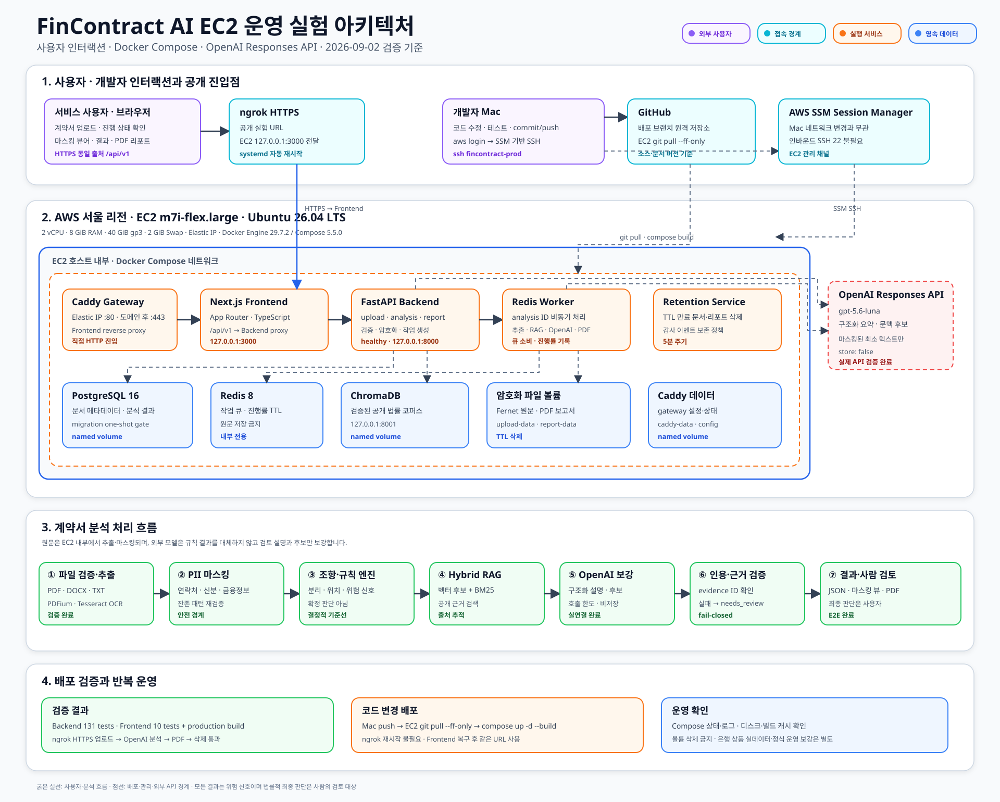

# 시스템 아키텍처

## 경계

- Frontend는 업로드, 진행 상태, 마스킹된 조항 확인과 분석 리포트를 담당합니다.
- FastAPI는 인증·검증·작업 생성·조회·삭제의 진입점입니다.
- 사용자 원문은 로컬 추출과 PII 마스킹 검증을 통과하기 전 외부 서비스로 전달하지 않습니다.
- ChromaDB는 검증된 공개·허가 리서치 코퍼스의 검색에만 사용합니다.
- PostgreSQL은 문서 메타데이터, 조항, 분석 결과, 버전과 삭제 이력의 기준 저장소입니다.
- 원문 파일은 별도 암호화 저장소에 TTL과 함께 보관합니다.
- Redis + Worker는 EC2 배포에서 분석 ID 기반 비동기 처리와 진행 상태를 담당합니다.
- Ubuntu EC2의 Docker Compose 네트워크 안에서 PostgreSQL, Redis, ChromaDB, Backend,
  worker, retention, Frontend와 Caddy를 실행합니다.
- 사용자는 ngrok HTTPS 또는 Caddy를 통해 Frontend에 접속하고, 개발자는 SSM 기반 SSH로
  배포합니다. Backend와 데이터 서비스의 호스트 포트는 공개하지 않습니다.

## 분석 흐름

1. 파일 확장자, MIME, signature와 크기를 검사합니다.
2. 텍스트를 로컬에서 추출합니다.
3. PII를 탐지·마스킹하고 외부 전송 payload를 재검증합니다.
4. 조항을 분리하고 문서 내 위치를 보존합니다.
5. 8개 결정적 규칙으로 위험 신호 후보를 생성합니다.
6. ChromaDB에서 법령·심결·판례·분쟁조정·조항 패턴을 검색합니다.
7. 마스킹된 최소 텍스트와 검색 근거만 OpenAI Responses API에 전달합니다.
8. Structured Outputs 응답의 evidence ID와 인용문을 검증합니다.
9. 근거가 부족하거나 검증에 실패하면 `needs_review`로 종료합니다.
10. 결과와 provenance를 저장하고 frontend에 반환합니다.

## 저장소 역할

| 저장소 | 저장 대상 | 금지 대상 |
|---|---|---|
| PostgreSQL | 작업 상태, 문서 메타데이터, 조항, 결과, 버전, 삭제 이력 | API 키 |
| 암호화 파일 저장소 | 사용자 원문, 생성 리포트 | 공개 검색 인덱스 |
| ChromaDB | 검증된 공개·허가 코퍼스의 chunk와 metadata | 사용자 계약서 원문 |
| Redis | 선택형 큐와 단기 진행 상태 | 영구 결과와 원문 |
