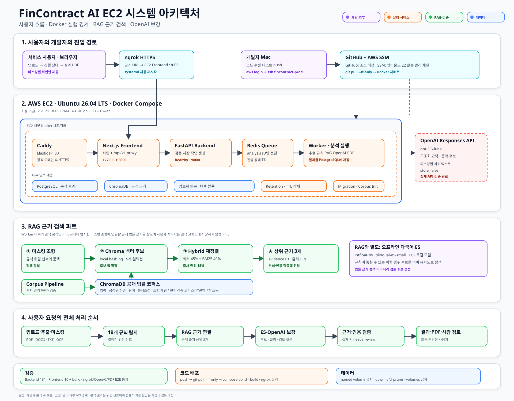

# 시스템 아키텍처

## 경계

- Frontend는 업로드, 진행 상태, 마스킹된 조항 확인과 분석 리포트를 담당합니다.
- FastAPI는 인증·검증·작업 생성·조회·삭제의 진입점입니다.
- 사용자 원문은 로컬 추출과 PII 마스킹 검증을 통과하기 전 외부 서비스로 전달하지 않습니다.
- ChromaDB의 법률 컬렉션에는 검증된 공개·허가 리서치 코퍼스만 저장합니다. 별도의
  `decision_cards` 컬렉션에는 일반화된 합성 판단 패턴만 저장하며 사용자 계약서와 법적
  근거에는 사용하지 않습니다.
- PostgreSQL은 문서 메타데이터, 조항, 분석 결과, 버전과 삭제 이력의 기준 저장소입니다.
- 원문 파일은 별도 암호화 저장소에 TTL과 함께 보관합니다.
- Redis + Worker는 EC2 배포에서 분석 ID 기반 비동기 처리와 진행 상태를 담당합니다.
- Ubuntu EC2의 Docker Compose 네트워크 안에서 PostgreSQL, Redis, ChromaDB, Backend,
  worker, retention, Frontend와 Caddy를 실행합니다.
- 사용자는 ngrok HTTPS 또는 Caddy를 통해 Frontend에 접속하고, 개발자는 SSM 기반 SSH로
  배포합니다. Backend와 데이터 서비스의 호스트 포트는 공개하지 않습니다.

## 분석 흐름

1. 파일 확장자, MIME, signature와 크기를 검사합니다.
2. 텍스트를 로컬에서 추출합니다.
3. PII를 탐지·마스킹하고 외부 전송 payload를 재검증합니다.
4. 조항을 분리하고 문서 내 위치를 보존합니다.
5. 19개 결정적 규칙으로 위험 신호를 생성합니다.
6. 오프라인 E5와 선택적 OpenAI 문맥 검토가 규칙 미매핑 의미 후보를 생성합니다.
7. 내부 decision-card RAG가 의미 후보를 위험 패턴과 정상 예외에 대조합니다. 완전한 정상
   예외와 충돌하는 후보만 제거하며 내부 점수와 카드는 공개 결과에 넣지 않습니다.
8. ChromaDB의 법률 컬렉션에서 법령·심결·판례·분쟁조정·조항 패턴을 검색합니다.
9. 마스킹된 최소 텍스트와 검색 근거만 OpenAI Responses API에 전달합니다.
10. Structured Outputs 응답의 evidence ID와 인용문을 검증합니다.
11. 근거가 부족하거나 검증에 실패하면 `needs_review`로 종료합니다.
12. 기존 공개 결과 형식을 유지한 채 결과와 provenance를 저장합니다.

## RAG와 의미 후보의 구분

- RAG는 규칙이 탐지한 마스킹 조항을 질의로 사용해 ChromaDB의 공개 법률 코퍼스에서
  근거 후보를 가져옵니다. 벡터 점수 45%, BM25 점수 40%, 출처 권위 점수 15%를 결합하고
  상위 3개 `evidence_id`를 분석과 인용 검증에 전달합니다.
- ChromaDB의 5개 컬렉션은 법령, 공정위 심결, 법원 판례, 분쟁조정 사례와 조항 패턴을
  구분합니다. 현재 검증된 공개 코퍼스는 약관법 7개 조문입니다.
- 오프라인 `multilingual-e5-small`은 규칙이 놓칠 가능성이 있는 위험 범주를 의미 유사도로
  찾고 `candidate_findings[]`에만 추가합니다. 같은 로컬 모델을 사용하는 별도 decision-card
  RAG는 후보를 내부 검증하지만 법률 근거 검색과 인덱스를 공유하지 않습니다.
- decision-card RAG는 벡터 60%, BM25 20%, 명시적 판단 요소 20%를 결합합니다. 정상 예외의
  필수 요소가 모두 확인될 때만 의미 후보를 제거하며, 모델이나 인덱스가 없으면 기존 후보를
  그대로 유지합니다.
- OpenAI는 RAG 검색을 대신하지 않습니다. 마스킹된 조항 문맥으로 추가 후보를 검토하고,
  검증된 규칙·근거 결과를 사용해 사용자용 요약을 보강합니다.

## 저장소 역할

| 저장소 | 저장 대상 | 금지 대상 |
|---|---|---|
| PostgreSQL | 작업 상태, 문서 메타데이터, 조항, 결과, 버전, 삭제 이력 | API 키 |
| 암호화 파일 저장소 | 사용자 원문, 생성 리포트 | 공개 검색 인덱스 |
| ChromaDB 법률 컬렉션 | 검증된 공개·허가 코퍼스의 chunk와 metadata | 사용자 계약서 원문, 합성 카드를 법적 근거로 표시 |
| ChromaDB decision_cards | 일반화된 합성 위험·정상 예외 패턴 | 사용자 계약서 원문, 공개 API 응답 |
| Redis | 선택형 큐와 단기 진행 상태 | 영구 결과와 원문 |
